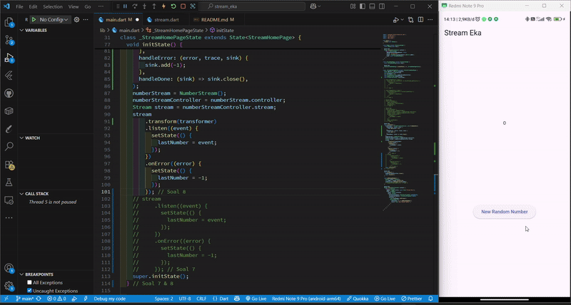
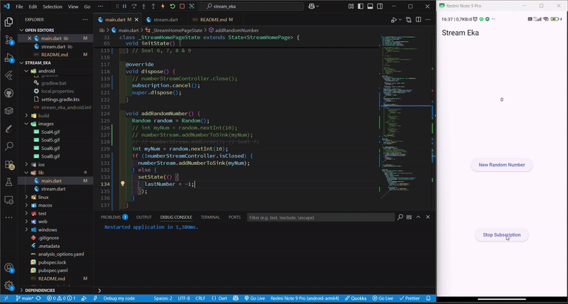

# Praktikum : State Management dengan Streams

## Praktikum 1 : Dart Streams

### Soal 1

Done

### Soal 2

Done

### Soal 3

```dart
yield* Stream.periodic(const Duration(seconds: 1), (int t) {
      int index = t % colors.length;
      return colors[index];
    });
```

1. Fungsi yield\*

   - Fngsi yield* dalam Dart digunakan untuk menggabungkan (delegate) hasil dari stream atau iterable lain ke dalam stream/function kita. Artinya, yield* akan "meneruskan" seluruh nilai dari stream atau iterable yang disebutkan.

   - Pada konteks ini, berarti fungsi yang kita buat akan menghasilkan stream yang berasal dari Stream.periodic(...), bukan hanya satu nilai, tapi seluruh isi stream-nya.
     Jika hanya yield saja, maka kita harus memanggil yield setiap elemen satu per satu secara manual.

2. Maksud isi dari perintah code tersebut

```dart
Stream.periodic(const Duration(seconds: 1), (int t) {
      int index = t % colors.length;
      return colors[index];
    });
```

- Stream.periodic membuat sebuah stream yang mengeluarkan nilai setiap 1 detik (Duration(seconds: 1)).

- Fungsi (int t) { ... } adalah generator yang dipanggil setiap kali waktu 1 detik berlalu.

- t adalah hitungan ke berapa kali stream memanggil fungsi itu (dimulai dari 0).

- int index = t % colors.length; artinya index akan berputar dari 0 sampai panjang warna - 1, lalu mengulang lagi (agar tidak keluar dari batas list colors).

- return colors[index]; akan mengembalikan warna dari list colors.

Kesimpulan :

Pada setiap detiknya, steram akan mmendapatkan 1 warna dari list colors secara urtu dan looping terus.

### Soal 4


### Soal 5


1. Menggunakan listen

- listen digunakan ketika kita ingin menjalankan aksi setiap kali ada data baru dari stream, tanpa harus menunggu stream selesai.
  Contoh : Ketika tampilan UI diperbarui, kita bisa menekan atau hold warna yang baru diperbarui

2. Menggunakan await for

- await for digunakan ketika kita ingin menunggu dan memproses setiap data dari stream secara berurutan, seperti membaca satu per satu dari antrian.
  Contoh : Kita menunggu semua warna yang ada dalam list keluar dahulu, baru setelah itu melanjutkan tugas selanjutnya.

## Praktikum 2 : Stream controllers dan sinks

### Soal 6


```dart
@override
  void initState() {
    numberStream = NumberStream();
    numberStreamController = numberStream.controller;
    Stream stream = numberStreamController.stream;
    stream.listen((event) {
      setState(() {
        lastNumber = event;
      });
    });
    super.initState();
  }
```

1. Maksud code initState() diatas

Fungsi initState() digunakan untuk menginisialisasi stream dan mulai mendengarkan data yang masuk.
Setiap kali ada angka baru yang dikirim ke stream, nilai lastNumber akan diubah dan UI akan diperbarui melalui setState().

2. Maksud code addRandomNuber() dibawah

```dart
void addRandomNumber() {
    Random random = Random();
    int myNum = random.nextInt(10);
    numberStream.addNumberToSink(myNum);
  }
```

Fungsi di addRandomNumber() digunakan untuk menghasilkan angka acak dari 0 sampai 9, lalu mengirim angka tersebut ke stream melalui addNumberToSink().

### Soal 7

```dart
addError() {
    controller.sink.addError('error');
  }
```

1. Pada langkah 13, method addError() digunakan untuk menambahkan kesalahan (error) secara manual ke dalam stream, controller.sink.addError('error') akan mengirimkan pesan error tersebut ke semua listener stream yang sedang aktif.

2. Pada langkah 15, kode tersebut bertujuan untuk handle error dari stream dengan menjalankan setState() untuk memperbarui lastNumber menjadi -1 sebagai indikasi error, tapi penulisannya masih salah secara sintaksis meskipun maksudnya sudah benar.

```dart
void addRandomNumber() {
    Random random = Random();
    numberStream.addError();
  }
```

## Praktikum 3 : Injeksi data ke streams

### Soal 8



1. Langkah 1

```dart
late StreamTransformer transformer;
```

Mendeklarasikan sebuah variabel dengan nama transformer dengan tipe dari variabel ini adalah StreamTransformer. Keyword late pada code ini artinya variabel ini belum langsung diinisialisasi, tapi akan diinisialisasi sebelum digunakan.

2. Langkah 2

```dart
stream
        .transform(transformer)
        .listen((event) {
          setState(() {
            lastNumber = event;
          });
        })
        .onError((error) {
          setState(() {
            lastNumber = -1;
          });
        });
```

Pada potongan code stream.transform(transformer), data dari stream akan diproses terlebih dahulu oleh variabel transformer sebelum diterukan ke listen().

Lalu pada potongan code **_*.listen((event) {setState(() { lastNumber = event;});});*_**, akan menangani data hasil transformasi dari step diatas.

Dan untuk potongan code **_*.onError((error) {setState(() { lastNumber = -1;});});*_** menangani error dari stream.

## Praktikum 4 : Subscribe ke stream events

### Soal 9



1. numberStream adalah instance dari class NumberStream yang menyediakan akses ke stream dan controllernya. controller digunakan untuk mengirim data ke stream, sedangkan stream tersebut didengarkan menggunakan listen(). Setiap data baru yang diterima akan disimpan ke lastNumber melalui setState() agar UI diperbarui. Hasil dari listen() disimpan dalam subscription, sehingga bisa dibatalkan nanti saat tidak dibutuhkan, misalnya di method dispose().

2. dispose() dipanggil saat widget dihapus, seperti saat berpindah halaman. Di dalamnya, subscription.cancel() digunakan untuk menghentikan stream agar tidak terjadi kebocoran memori dan tidak memproses data saat widget sudah tidak aktif. Pemanggilan super.dispose() memastikan proses pembersihan bawaan tetap berjalan dengan semestinya.

3. Fungsi ini menambahkan angka acak (0–9) ke stream menggunakan random.nextInt(10). Sebelum mengirim, dicek apakah controller masih terbuka untuk menghindari error. Jika masih terbuka, angka dikirim melalui addNumberToSink(). Jika sudah tertutup, lastNumber diatur ke -1 sebagai penanda error yang bisa ditampilkan di UI.

## Praktikum 5 : Multiple stream subscriptions

### Soal 10


Error "Bad state: Stream has already been listened to" bisa terjadi karena ketika sebuah stream biasa (single-subscription stream) didengarkan (listen) lebih dari satu kali. Secara default, stream di Dart hanya bisa memiliki satu listener. Jika kita mencoba mendengarkannya lagi tanpa mengubahnya menjadi broadcast stream, maka akan muncul error ini.

### Soal 11


Saat tombol 'New Random Number' ditekan beberapa kali, akan muncul angka double/duplikat di layar. Mucul angka double ini karena terdapat dua listener yang aktif pada stream yang sama. Setiap kali tombol ditekan, memang hanya satu angka acak yang dikirim ke stream, namun karena dua listener sedang mendengarkan, maka fungsi setState() juga dipanggil dua kali. Akibatnya, angka yang ditampilkan pada UI menjadi duplikat atau bertambah dua kali, meskipun hanya satu data yang dikirim. Masalah ini umum terjadi jika listen() dipanggil berulang tanpa membatalkan atau mengelola listener dengan benar.
