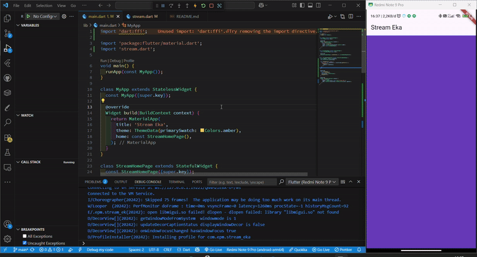
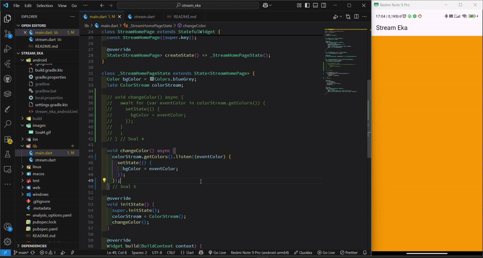
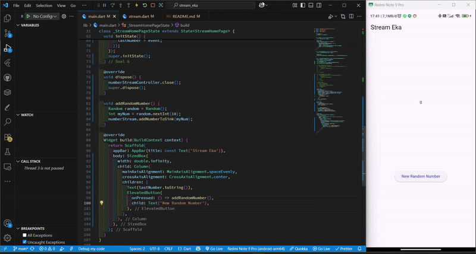

# Praktikum : State Management dengan Streams

## Praktikum 1 : Dart Streams

### Soal 1

Done

### Soal 2

Done

### Soal 3

```dart
yield* Stream.periodic(const Duration(seconds: 1), (int t) {
      int index = t % colors.length;
      return colors[index];
    });
```

1. Fungsi yield\*

   - Fngsi yield* dalam Dart digunakan untuk menggabungkan (delegate) hasil dari stream atau iterable lain ke dalam stream/function kita. Artinya, yield* akan "meneruskan" seluruh nilai dari stream atau iterable yang disebutkan.

   - Pada konteks ini, berarti fungsi yang kita buat akan menghasilkan stream yang berasal dari Stream.periodic(...), bukan hanya satu nilai, tapi seluruh isi stream-nya.
     Jika hanya yield saja, maka kita harus memanggil yield setiap elemen satu per satu secara manual.

2. Maksud isi dari perintah code tersebut

```dart
Stream.periodic(const Duration(seconds: 1), (int t) {
      int index = t % colors.length;
      return colors[index];
    });
```

- Stream.periodic membuat sebuah stream yang mengeluarkan nilai setiap 1 detik (Duration(seconds: 1)).

- Fungsi (int t) { ... } adalah generator yang dipanggil setiap kali waktu 1 detik berlalu.

- t adalah hitungan ke berapa kali stream memanggil fungsi itu (dimulai dari 0).

- int index = t % colors.length; artinya index akan berputar dari 0 sampai panjang warna - 1, lalu mengulang lagi (agar tidak keluar dari batas list colors).

- return colors[index]; akan mengembalikan warna dari list colors.

Kesimpulan :

Pada setiap detiknya, steram akan mmendapatkan 1 warna dari list colors secara urtu dan looping terus.

### Soal 4



### Soal 5



1. Menggunakan listen

- listen digunakan ketika kita ingin menjalankan aksi setiap kali ada data baru dari stream, tanpa harus menunggu stream selesai.
  Contoh : Ketika tampilan UI diperbarui, kita bisa menekan atau hold warna yang baru diperbarui

2. Menggunakan await for

- await for digunakan ketika kita ingin menunggu dan memproses setiap data dari stream secara berurutan, seperti membaca satu per satu dari antrian.
  Contoh : Kita menunggu semua warna yang ada dalam list keluar dahulu, baru setelah itu melanjutkan tugas selanjutnya.

## Praktikum 2 : Stream controllers dan sinks

### Soal 6



```dart
@override
  void initState() {
    numberStream = NumberStream();
    numberStreamController = numberStream.controller;
    Stream stream = numberStreamController.stream;
    stream.listen((event) {
      setState(() {
        lastNumber = event;
      });
    });
    super.initState();
  }
```

1. Maksud code initState() diatas

Fungsi initState() digunakan untuk menginisialisasi stream dan mulai mendengarkan data yang masuk.
Setiap kali ada angka baru yang dikirim ke stream, nilai lastNumber akan diubah dan UI akan diperbarui melalui setState().

2. Maksud code addRandomNuber() dibawah

```dart
void addRandomNumber() {
    Random random = Random();
    int myNum = random.nextInt(10);
    numberStream.addNumberToSink(myNum);
  }
```

Fungsi di addRandomNumber() digunakan untuk menghasilkan angka acak dari 0 sampai 9, lalu mengirim angka tersebut ke stream melalui addNumberToSink().

### Soal 7

```dart
addError() {
    controller.sink.addError('error');
  }
```

1. Pada langkah 13, method addError() digunakan untuk menambahkan kesalahan (error) secara manual ke dalam stream, controller.sink.addError('error') akan mengirimkan pesan error tersebut ke semua listener stream yang sedang aktif.

2. Pada langkah 15, kode tersebut bertujuan untuk handle error dari stream dengan menjalankan setState() untuk memperbarui lastNumber menjadi -1 sebagai indikasi error, tapi penulisannya masih salah secara sintaksis meskipun maksudnya sudah benar.

```dart
void addRandomNumber() {
    Random random = Random();
    numberStream.addError();
  }
```
